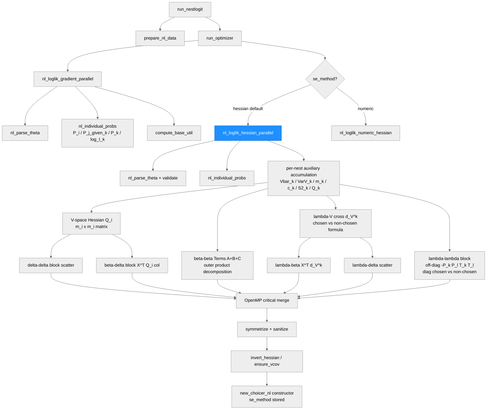
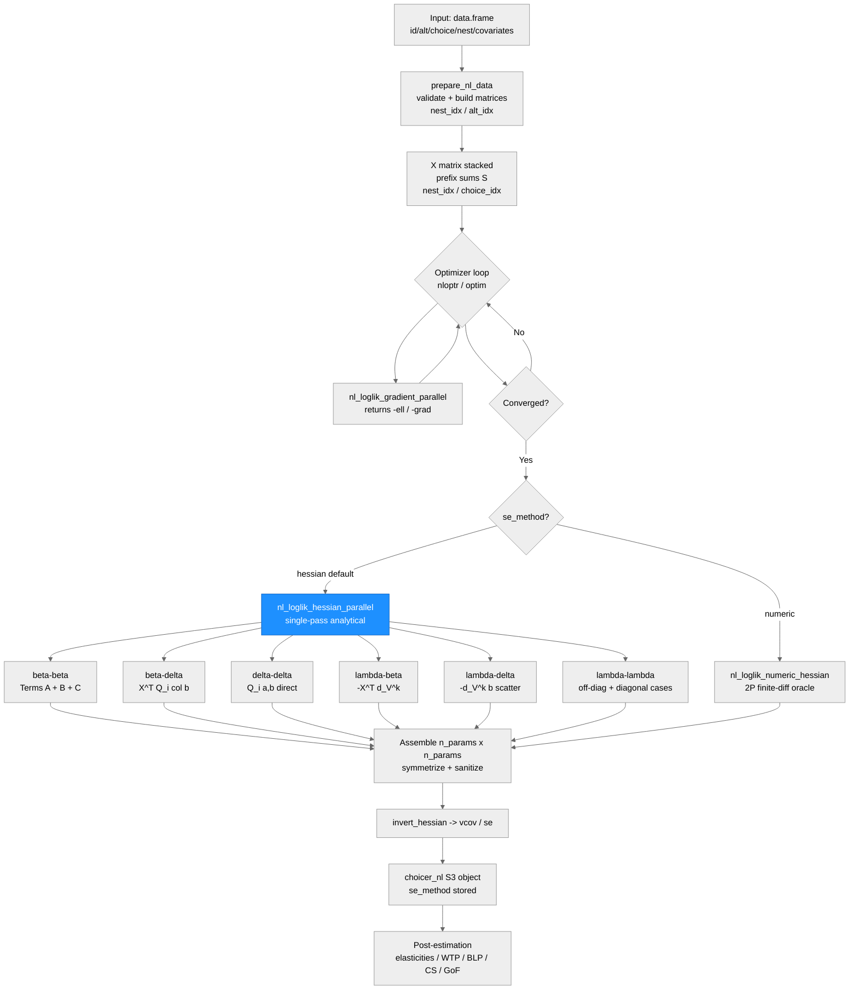

# choicer — System Architecture

**Run:** O1 Analytical NL Hessian
**Date:** 2026-06-19
**Commit:** 39f50fd (worktree: agent-a0890026f7ebb629e)

---

## System Architecture

### Module Structure

```mermaid
%%{init: {'theme': 'neutral'}}%%
graph TD
    subgraph API["API Layer — R"]
        MNL[mnlogit_utils.R<br/>run_mnlogit / prepare_mnl_data]
        MXL[mxlogit_utils.R<br/>run_mxlogit / prepare_mxl_data]
        NL[nestlogit_utils.R<br/>run_nestlogit / prepare_nl_data]
        MNP[mnprobit_utils.R<br/>run_mnprobit / prepare_mnp_data]
    end

    subgraph Core["Core Layer — R"]
        CLS[classes.R<br/>constructors / run_optimizer<br/>compute_hessian / ensure_vcov]
        MTH[methods.R<br/>S3 generics + methods<br/>coef / vcov / predict<br/>elasticities / blp / diversion]
        WTP[wtp.R<br/>wtp — delta-method SEs]
        SRP[surplus.R<br/>logsum / consumer_surplus]
        GOF[gof.R<br/>gof — McFadden R2 / hit rate]
        PND[predict_newdata.R<br/>resolve_predict_newdata]
        SMP[sampling.R<br/>wesml_weights<br/>sample_choice_based]
        SIM[simulation.R<br/>simulate_*_data — DGPs]
        REC[recovery.R<br/>recovery_table / monte_carlo<br/>mc_asymptotics]
        UTL[utils.R<br/>shared helpers]
    end

    subgraph CPP["C++ Kernel Layer — src/"]
        MNLC[mnlogit.cpp<br/>loglik / gradient / Hessian<br/>BLP / elasticities]
        MXLC[mxlogit.cpp<br/>loglik / gradient / Hessian<br/>BHHH / Halton]
        NLC[nestlogit.cpp<br/>loglik / gradient<br/>analytical + numeric Hessian]
        MNPC[mnprobit.cpp<br/>Gibbs sampler]
        UTLC[utils.cpp<br/>softmax / shared kernels]
    end

    subgraph HDR["C++ Headers — src/"]
        CH[choicer.h<br/>public header]
        CIH[choicer_internal.h<br/>internal structs]
        BSH[bayes_samplers.h<br/>MNP samplers]
        RNG[rng.h<br/>thread-safe RNG]
        HAL[halton.h<br/>HaltonGen — on-the-fly draws]
    end

    MNL --> CLS
    MXL --> CLS
    NL  --> CLS
    MNP --> CLS

    CLS --> MTH
    CLS --> MNLC
    CLS --> MXLC
    CLS --> NLC
    CLS --> MNPC

    MTH --> WTP
    MTH --> SRP
    MTH --> GOF
    MTH --> PND

    MNLC --> UTLC
    MXLC --> UTLC
    NLC  --> UTLC
    MNPC --> BSH
    MNPC --> RNG
    MXLC --> HAL

    MNLC --> CIH
    MXLC --> CIH
    NLC  --> CIH
    MNPC --> CIH
    CIH  --> CH

    SIM --> REC
    SMP --> MNL

    style NLC fill:#1e90ff,stroke:#1565c0,color:#fff
    style NL fill:#1e90ff,stroke:#1565c0,color:#fff
    style CLS fill:#1e90ff,stroke:#1565c0,color:#fff
```

| Module | Purpose | Key Dependencies | Changed in This Run |
|--------|---------|-----------------|---------------------|
| `R/mnlogit_utils.R` | Data prep and estimation wrapper for MNL | classes.R, mnlogit.cpp | No |
| `R/mxlogit_utils.R` | Data prep and estimation wrapper for MXL; BHHH SE | classes.R, mxlogit.cpp | No |
| `R/nestlogit_utils.R` | Data prep and estimation wrapper for NL; `se_method` dispatch | classes.R, nestlogit.cpp | **YES — `se_method` parameter** |
| `R/mnprobit_utils.R` | Data prep and estimation wrapper for Bayesian MNP | classes.R, mnprobit.cpp | No |
| `R/classes.R` | S3 constructors, optimizer dispatch, Hessian inversion | nloptr, all C++ kernels | **YES — NL `se_method` wiring** |
| `R/methods.R` | S3 generics: coef, vcov, predict, elasticities, blp, diversion | classes.R | No |
| `R/wtp.R` | WTP with delta-method SEs | methods.R | No |
| `R/surplus.R` | Logsum and consumer surplus | methods.R | No |
| `R/gof.R` | Goodness-of-fit statistics | methods.R | No |
| `R/predict_newdata.R` | Counterfactual prediction helper | methods.R | No |
| `R/sampling.R` | WESML weights and choice-based sampling | utils.R | No |
| `R/simulation.R` | DGPs for MNL/MXL/NL/MNP simulation | recovery.R | No |
| `R/recovery.R` | Parameter-recovery diagnostics, Monte Carlo | simulation.R | No |
| `R/utils.R` | Shared R helpers | — | No |
| `src/mnlogit.cpp` | MNL likelihood, gradient, Hessian (block-decomposition), post-estimation | choicer_internal.h, utils.cpp | No |
| `src/mxlogit.cpp` | MXL likelihood, gradient, Hessian, BHHH, Halton | choicer_internal.h, halton.h, utils.cpp | No |
| `src/nestlogit.cpp` | NL likelihood, gradient, **analytical Hessian (new)**, numeric oracle | choicer_internal.h, utils.cpp | **YES — `nl_loglik_hessian_parallel`** |
| `src/mnprobit.cpp` | Bayesian MNP Gibbs sampler | bayes_samplers.h, rng.h | No |
| `src/utils.cpp` | Shared C++ kernels: softmax, log-sum-exp | choicer_internal.h | No |
| `src/choicer.h` | Public C++ API header | — | No |
| `src/choicer_internal.h` | Internal structs and validation helpers | choicer.h | No |
| `src/bayes_samplers.h` | MNP-specific sampling routines | rng.h | No |
| `src/rng.h` | Thread-safe per-draw RNG | — | No |
| `src/halton.h` | On-the-fly Halton draw generator (HaltonGen) | — | No |
| `docs/nested_logit_math.md` | NL mathematical reference | — | **YES — §4 rewritten** |

---

### Function Call Graph

#### Main Pipeline: NL Estimation (this run's change)

| Function | Purpose | Key Dependencies | Changed in This Run |
|----------|---------|-----------------|---------------------|
| `run_nestlogit` | Public NL estimation entry point; `se_method` dispatch | prepare_nl_data, run_optimizer | **YES** |
| `prepare_nl_data` | Validates inputs, builds X matrix, prefix sums, nest mapping | data.table | No |
| `run_optimizer` | Unified optimizer dispatch (nloptr / optim / custom) | nloptr | No |
| `nl_loglik_gradient_parallel` | NL log-likelihood and gradient (OpenMP) | nl_individual_probs | No |
| `nl_loglik_hessian_parallel` | **NEW: single-pass analytical Hessian of -loglik** | nl_individual_probs, nl_parse_theta | **YES** |
| `nl_loglik_numeric_hessian` | Numeric oracle: 2P finite-diff passes on gradient (retained) | nl_loglik_gradient_parallel | No |
| `nl_individual_probs` | Per-individual P_i, P_j\|k, P_k, log_I_k | — | No |
| `nl_parse_theta` | Splits theta into beta/lambda/delta; builds nest_k_to_theta_idx | — | No |
| `invert_hessian` | Invert Hessian to get vcov; fallback to pseudo-inverse | arma::inv_sympd | No |
| `new_choicer_nl` | S3 constructor for choicer_nl objects; stores `se_method` | — | **YES** |
| `compute_hessian` (NL branch) | Dispatches to analytical or numeric Hessian based on `se_method` | nl_loglik_hessian_parallel | **YES** |

---

### Data Flow

---

## Key Architectural Change — O1 Analytical NL Hessian

### Before

`run_nestlogit()` always called `nl_loglik_numeric_hessian`, which computed the Hessian of the negated log-likelihood via $2P$ central finite-difference passes over the analytical gradient (cost: $2P$ gradient evaluations = $O(N \cdot J \cdot P)$ per evaluation, $2P$ evaluations total).

### After

A new exported C++ function `nl_loglik_hessian_parallel` computes the exact analytical Hessian in a **single pass** over individuals. It shares the same parameter layout, OpenMP structure, and sign convention as the gradient, and is numerically equivalent to the numeric oracle at worst-case $\approx 2.6 \times 10^{-8}$ (38× below the $10^{-6}$ equivalence gate).

**R-side:** `run_nestlogit(..., se_method = "hessian")` (new default) routes to the analytical path. `se_method = "numeric"` retains the oracle for diagnostic comparison.

**Six second-derivative blocks:**

| Block | Dimensions | Key formula/structure |
|-------|-----------|----------------------|
| beta-beta | $K \times K$ | $\mathbf{X}_i^T \mathbf{Q}_i \mathbf{X}_i$ via outer-product decomposition (Terms A, B, C) |
| beta-delta | $K \times J_\text{asc}$ | $\mathbf{X}_i^T \mathbf{Q}_i[:, b']$ for free-ASC alternative $b'$ |
| delta-delta | $J_\text{asc} \times J_\text{asc}$ | $Q_i[a', b']$ direct from V-space Hessian |
| lambda-beta | $K_\lambda \times K$ | $-\mathbf{X}_i^T \mathbf{d}^{(k)}$ (lambda-V cross derivative) |
| lambda-delta | $K_\lambda \times J_\text{asc}$ | $-d^{(k)}_{b'}$ (lambda-V cross derivative, scatter) |
| lambda-lambda | $K_\lambda \times K_\lambda$ | off-diag: $-P_k P_l T_k T_l$; diagonal: two cases (chosen/non-chosen nest) |

**Two spec bugs corrected by the builder (implementation is source of truth):**

1. **Q_i formula**: The spec's phi term incorrectly had an extra $P(b\mid k)$ factor on the $\mathbf{1}_{a=b}/\lambda_k$ term. The correct within-nest contribution is $P_{ia} \cdot [\mathbf{1}_{a=b}/\lambda_k + P(b\mid k)(1 - 1/\lambda_k)]$. MNL limit verification: at $\lambda_k = 1$, $Q_i[a,a] = P_{ia}(1-P_{ia})$ as required.

2. **Beta-beta sign convention**: The spec's Terms A/B/C gave the Hessian of $+\ell$ (negative semi-definite). The correct Hessian of $-\ell$ (positive semi-definite at the MLE) requires all three term signs flipped: Term A subtracted, Term B added, Term C subtracted.
