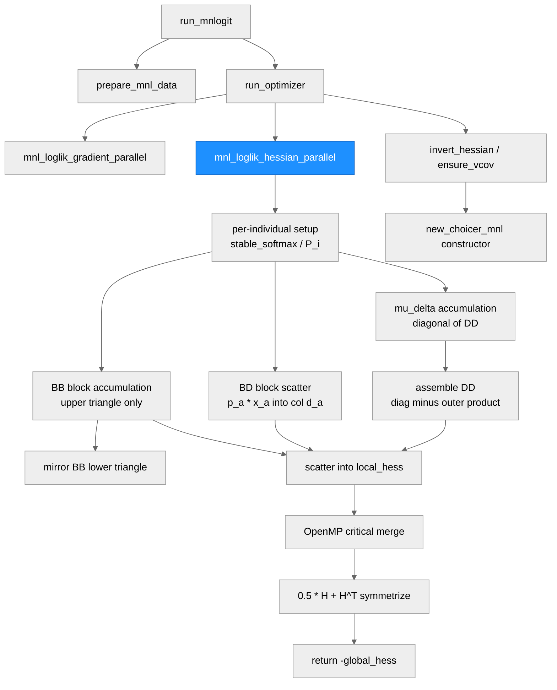
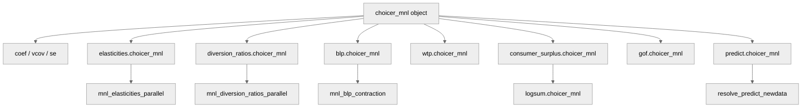
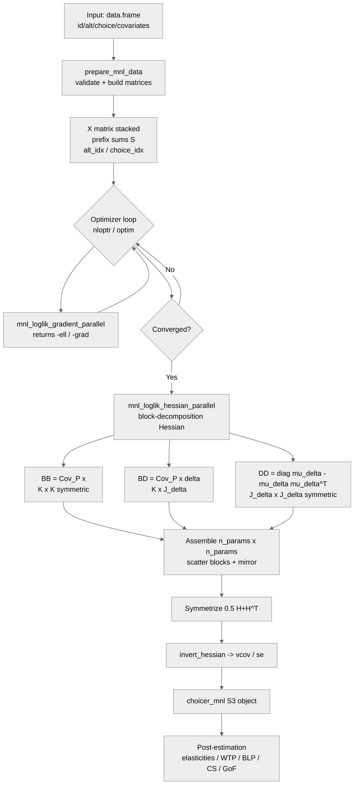

# choicer — System Architecture

**Run:** Phase 1 MNL Hessian Optimization (O2 + O5)
**Date:** 2026-06-19
**Commit:** 608dfa0 (builder worktree: agent-ae3c8e297efc3e74f)

---

## System Architecture

### Module Structure

```mermaid
%%{init: {'theme': 'neutral'}}%%
graph TD
    subgraph API["API Layer — R"]
        MNL[mnlogit_utils.R<br/>run_mnlogit / prepare_mnl_data]
        MXL[mxlogit_utils.R<br/>run_mxlogit / prepare_mxl_data]
        NL[nestlogit_utils.R<br/>run_nestlogit / prepare_nl_data]
        MNP[mnprobit_utils.R<br/>run_mnprobit / prepare_mnp_data]
    end

    subgraph Core["Core Layer — R"]
        CLS[classes.R<br/>constructors / run_optimizer<br/>compute_hessian / ensure_vcov]
        MTH[methods.R<br/>S3 generics + methods<br/>coef / vcov / predict<br/>elasticities / blp / diversion]
        WTP[wtp.R<br/>wtp — delta-method SEs]
        SRP[surplus.R<br/>logsum / consumer_surplus]
        GOF[gof.R<br/>gof — McFadden R2 / hit rate]
        PND[predict_newdata.R<br/>resolve_predict_newdata]
        SMP[sampling.R<br/>wesml_weights<br/>sample_choice_based]
        SIM[simulation.R<br/>simulate_*_data — DGPs]
        REC[recovery.R<br/>recovery_table / monte_carlo<br/>mc_asymptotics]
        UTL[utils.R<br/>shared helpers]
    end

    subgraph CPP["C++ Kernel Layer — src/"]
        MNLC[mnlogit.cpp<br/>loglik / gradient / Hessian<br/>BLP / elasticities]
        MXLC[mxlogit.cpp<br/>loglik / gradient / Hessian<br/>BHHH / Halton]
        NLC[nestlogit.cpp<br/>loglik / gradient / Hessian]
        MNPC[mnprobit.cpp<br/>Gibbs sampler]
        UTLC[utils.cpp<br/>softmax / shared kernels]
    end

    subgraph HDR["C++ Headers — src/"]
        CH[choicer.h<br/>public header]
        CIH[choicer_internal.h<br/>internal structs]
        BSH[bayes_samplers.h<br/>MNP samplers]
        RNG[rng.h<br/>thread-safe RNG]
        HAL[halton.h<br/>HaltonGen — on-the-fly draws]
    end

    MNL --> CLS
    MXL --> CLS
    NL  --> CLS
    MNP --> CLS

    CLS --> MTH
    CLS --> MNLC
    CLS --> MXLC
    CLS --> NLC
    CLS --> MNPC

    MTH --> WTP
    MTH --> SRP
    MTH --> GOF
    MTH --> PND

    MNLC --> UTLC
    MXLC --> UTLC
    NLC  --> UTLC
    MNPC --> BSH
    MNPC --> RNG
    MXLC --> HAL

    MNLC --> CIH
    MXLC --> CIH
    NLC  --> CIH
    MNPC --> CIH
    CIH  --> CH

    SIM --> REC
    SMP --> MNL
```

| Module | Purpose | Key Dependencies | Changed in This Run |
|--------|---------|-----------------|---------------------|
| `R/mnlogit_utils.R` | Data prep and estimation wrapper for MNL | classes.R, mnlogit.cpp | No |
| `R/mxlogit_utils.R` | Data prep and estimation wrapper for MXL; BHHH SE | classes.R, mxlogit.cpp | No |
| `R/nestlogit_utils.R` | Data prep and estimation wrapper for NL | classes.R, nestlogit.cpp | No |
| `R/mnprobit_utils.R` | Data prep and estimation wrapper for Bayesian MNP | classes.R, mnprobit.cpp | No |
| `R/classes.R` | S3 constructors, optimizer dispatch, Hessian inversion | nloptr, all C++ kernels | No |
| `R/methods.R` | S3 generics: coef, vcov, predict, elasticities, blp, diversion | classes.R | No |
| `R/wtp.R` | WTP with delta-method SEs | methods.R | No |
| `R/surplus.R` | Logsum and consumer surplus | methods.R | No |
| `R/gof.R` | Goodness-of-fit statistics | methods.R | No |
| `R/predict_newdata.R` | Counterfactual prediction helper | methods.R | No |
| `R/sampling.R` | WESML weights and choice-based sampling | utils.R | No |
| `R/simulation.R` | DGPs for MNL/MXL/NL/MNP simulation | recovery.R | No |
| `R/recovery.R` | Parameter-recovery diagnostics, Monte Carlo | simulation.R | No |
| `R/utils.R` | Shared R helpers | — | No |
| `src/mnlogit.cpp` | MNL likelihood, gradient, **Hessian (rewritten)**, post-estimation | choicer_internal.h, utils.cpp | **YES** |
| `src/mxlogit.cpp` | MXL likelihood, gradient, Hessian, BHHH, Halton | choicer_internal.h, halton.h, utils.cpp | No |
| `src/nestlogit.cpp` | NL likelihood, gradient, Hessian | choicer_internal.h, utils.cpp | No |
| `src/mnprobit.cpp` | Bayesian MNP Gibbs sampler | bayes_samplers.h, rng.h | No |
| `src/utils.cpp` | Shared C++ kernels: softmax, log-sum-exp | choicer_internal.h | No |
| `src/choicer.h` | Public C++ API header | — | No |
| `src/choicer_internal.h` | Internal structs and validation helpers | choicer.h | No |
| `src/bayes_samplers.h` | MNP-specific sampling routines | rng.h | No |
| `src/rng.h` | Thread-safe per-draw RNG | — | No |
| `src/halton.h` | On-the-fly Halton draw generator (HaltonGen) | — | No |

---

### Function Call Graph

#### Main Pipeline: MNL Estimation

#### Post-Estimation Pipeline

| Function | Purpose | Key Dependencies | Changed in This Run |
|----------|---------|-----------------|---------------------|
| `run_mnlogit` | Public estimation entry point | prepare_mnl_data, run_optimizer | No |
| `prepare_mnl_data` | Validates inputs, builds X matrix, prefix sums S | data.table | No |
| `run_optimizer` | Unified optimizer dispatch (nloptr / optim / custom) | nloptr | No |
| `mnl_loglik_gradient_parallel` | MNL log-likelihood and gradient (OpenMP) | stable_softmax | No |
| `mnl_loglik_hessian_parallel` | **MNL analytical Hessian — block-decomposition rewrite** | stable_softmax, fill_choice_utilities | **YES** |
| `invert_hessian` | Invert Hessian to get vcov; fallback to pseudo-inverse | arma::inv_sympd | No |
| `new_choicer_mnl` | S3 constructor for choicer_mnl objects | — | No |
| `elasticities.choicer_mnl` | Own- and cross-elasticities | mnl_elasticities_parallel | No |
| `diversion_ratios.choicer_mnl` | Diversion ratio matrix | mnl_diversion_ratios_parallel | No |
| `blp.choicer_mnl` | BLP contraction mapping to recover ASCs from shares | mnl_blp_contraction | No |
| `wtp.choicer_mnl` | WTP ratios with delta-method SEs | coef, vcov | No |
| `consumer_surplus.choicer_mnl` | CV via logsum difference | logsum.choicer_mnl | No |
| `gof.choicer_mnl` | McFadden R2, adjusted R2, hit rate | logLik | No |

---

### Data Flow

---

## Key Architectural Decision — Phase 1 MNL Hessian Optimization

The sole change in this run is an internal rewrite of `mnl_loglik_hessian_parallel` in `src/mnlogit.cpp`. The public API surface (function signature, return type, R-visible behavior) is unchanged.

**Before (dense outer product):** For each individual $i$, the inner alternative loop assembled a full $n_\mathrm{params}$-dimensional score vector $Z_a$ and accumulated $\sum_a p_a Z_a Z_a^T$ as a dense $n_\mathrm{params} \times n_\mathrm{params}$ matrix. Cost: $O(J \cdot n_\mathrm{params}^2)$ per individual.

**After (block decomposition):** Exploits the sparsity of $Z_a$ — only $K+1$ nonzero entries — to accumulate three blocks separately:
- BB ($K \times K$): upper triangle only, mirrored once. Cost: $O(J \cdot K^2/2)$.
- BD ($K \times J_\delta$): scatter $p_a x_a$ into column $d(a)$. Cost: $O(J \cdot K)$.
- DD ($J_\delta \times J_\delta$): built from $\mu_\delta$ vector after the loop. Cost: $O(J_\delta^2/2)$.

Asymptotic gain: $(1 + J_\delta/K)^2$. Verified numerically equivalent to within $\approx 10^{-9}$.
