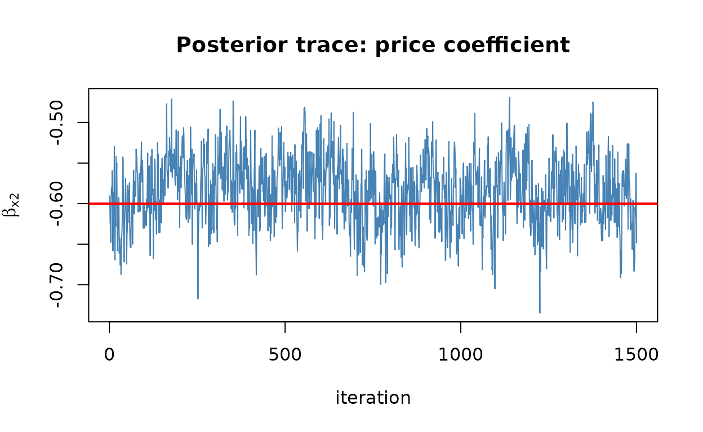

# Bayesian multinomial probit

The multinomial probit (MNP) replaces logit’s restrictive error
structure with a *full multivariate-normal* covariance, so it can
capture rich correlation between alternatives without imposing IIA.
choicer estimates it the Bayesian way: a Gibbs sampler with data
augmentation, written in C++ with a reproducible, thread-safe random
number generator.

``` r

library(choicer)
set_num_threads(2)
```

## Simulate from a probit process

[`simulate_mnp_data()`](https://fpcordeiro.github.io/choicer/reference/simulate_mnp_data.md)
draws choices with correlated normal errors and known parameters.

``` r

sim <- simulate_mnp_data(N = 2000, J = 3, seed = 1)
sim
#> <choicer_sim: mnp>
#>   settings:
#>     N = 2000
#>     J = 3
#>     K_x = 2
#>     base_alt = 1
#>   rows in $data: 6000
#>   true_params: beta, delta, Sigma
```

## Run the sampler

[`run_mnprobit()`](https://fpcordeiro.github.io/choicer/reference/run_mnprobit.md)
returns posterior draws. The settings below keep this vignette quick;
for real work use a longer chain and inspect convergence carefully.

``` r

set.seed(3)
fit <- run_mnprobit(
  data           = sim$data,
  id_col         = "id",
  alt_col        = "alt",
  choice_col     = "choice",
  covariate_cols = c("x1", "x2"),
  mcmc           = list(R = 4000, burn = 1000, thin = 2)
)
#> MCMC run time 0h:0m:0.68s
summary(fit)
#> Bayesian Multinomial Probit (MNP) model
#> 
#> Parameter        Mean         SD       2.5%     Median      97.5%
#> x1           0.784098   0.045637   0.699207   0.784063   0.874743
#> x2          -0.583731   0.041139  -0.663752  -0.581591  -0.506443
#> ASC_2        0.475191   0.043400   0.386551   0.476124   0.556880
#> ASC_3       -0.535270   0.107072  -0.792166  -0.522177  -0.358784
#> 
#> Covariance of utility differences (Sigma, identified scale):
#> Parameter        Mean         SD       2.5%     Median      97.5%
#> Sigma_11     1.000000   0.000000   1.000000   1.000000   1.000000
#> Sigma_21     0.421483   0.135394   0.120788   0.431610   0.680176
#> Sigma_22     1.421073   0.279614   0.965189   1.391781   2.003076
#> 
#> Posterior mean Sigma:
#>        w_2    w_3
#> w_2 1.0000 0.4215
#> w_3 0.4215 1.4211
#> 
#> Base alternative: 1 
#> Draws kept: 1500 (R = 4000, burn = 1000, thin = 2, seed = 721735354)
#> N: 2000  | Parameters: 4 
#> Sampling time: 0.68 s
#> Identification: per-draw normalization by sigma_11 (McCulloch-Rossi 1994).
```

The `Sigma` entries are the error-covariance parameters — the
flexibility that distinguishes probit from logit. They are identified
only up to scale, so choicer reports them on the normalized scale where
`Sigma_11 = 1`.

## Posterior recovers the truth

``` r

recovery_table(fit, sim$true_params)
#> <choicer_recovery> model=choicer_mnp level=0.95
#>    parameter  group  true estimate     se    bias rel_bias_pct z_vs_true
#>       <char> <char> <num>    <num>  <num>   <num>        <num>     <num>
#> 1:        x1   beta   0.8   0.7841 0.0456 -0.0159       -1.988   -0.3484
#> 2:        x2   beta  -0.6  -0.5837 0.0411  0.0163       -2.712    0.3955
#> 3:     ASC_2    asc   0.5   0.4752 0.0434 -0.0248       -4.962   -0.5716
#> 4:     ASC_3    asc  -0.5  -0.5353 0.1071 -0.0353        7.054   -0.3294
#> 5:  Sigma_11  sigma   1.0   1.0000 0.0000  0.0000        0.000        NA
#> 6:  Sigma_21  sigma   0.5   0.4215 0.1354 -0.0785      -15.703   -0.5799
#> 7:  Sigma_22  sigma   1.5   1.4211 0.2796 -0.0789       -5.262   -0.2823
#>    lower_ci upper_ci covers
#>       <num>    <num> <lgcl>
#> 1:   0.6947   0.8735   TRUE
#> 2:  -0.6644  -0.5031   TRUE
#> 3:   0.3901   0.5603   TRUE
#> 4:  -0.7451  -0.3254   TRUE
#> 5:   1.0000   1.0000   TRUE
#> 6:   0.1561   0.6869   TRUE
#> 7:   0.8730   1.9691   TRUE
```

## A quick MCMC diagnostic

Posterior draws are stored on the fit, so the usual diagnostics are a
line away. A trace plot of the price coefficient should look like a
stationary “fuzzy caterpillar”:

``` r

beta_draws <- fit$draws$beta
plot(beta_draws[, "x2"], type = "l", col = "steelblue",
     xlab = "iteration", ylab = expression(beta[x2]),
     main = "Posterior trace: price coefficient")
abline(h = sim$true_params$beta[2], col = "red", lwd = 2)
```



The red line marks the true value; the chain should hover around it. For
a faster, frequentist alternative with the same post-estimation toolkit,
see the [multinomial
logit](https://fpcordeiro.github.io/choicer/articles/mnl.md) and [mixed
logit](https://fpcordeiro.github.io/choicer/articles/mxl.md) vignettes.
